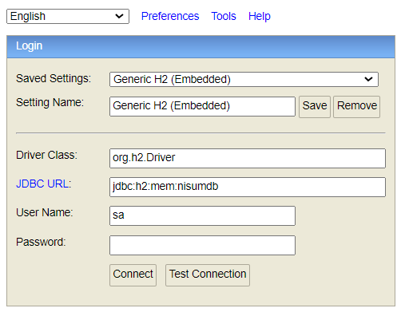
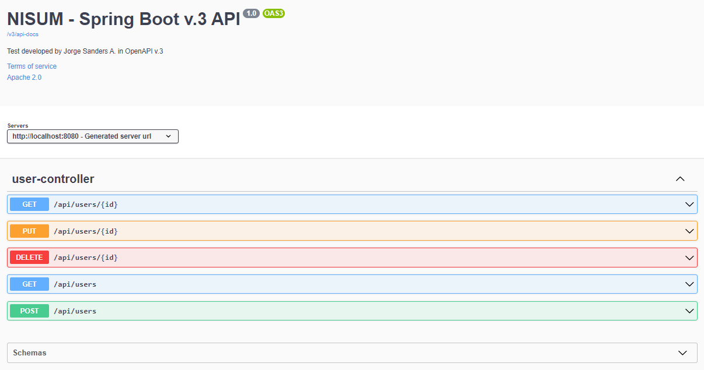
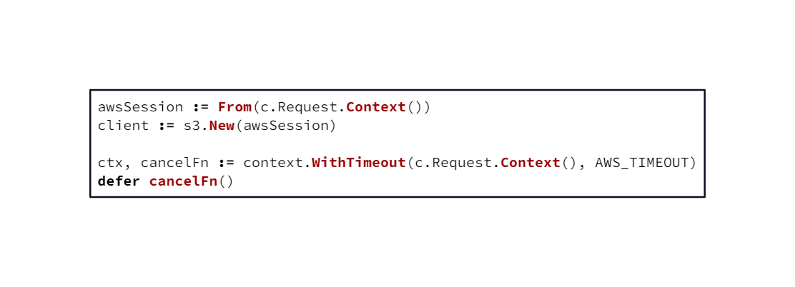

## Nisum-Test

### API Version

| Version | Major | Minor |
|:-------:|:-----:|:-----:|
|    1    |   0   |   0   |

### Categories
- RESTful API with Spring Boot 3.0.12
- Java SE 17
- SDK 17
- OpenAPI v3

### Tools
**Java:**
- Java version "17.0.9" (2023-10-17 LTS)
- Java(TM) SE Runtime Environment (build 17.0.9+11-LTS-201)
- Java HotSpot(TM) 64-Bit Server VM (build 17.0.9+11-LTS-201, mixed mode, sharing)

**Maven:**
- Apache Maven 3.9.5 (57804ffe001d7215b5e7bcb531cf83df38f93546)

### IDE
- IntelliJ IDEA 2023.2.3 (Community Edition)
- Build #IC-232.10072.27, built on October 11, 2023
- Runtime version: 17.0.8.1+7-b1000.32 amd64

### Libraries
- Spring Web (WEB): Build web applications, including RESTful ones, using Spring MVC. It uses Apache Tomcat as the default embedded container.

- H2 Database (SQL): Provides a fast in-memory database that supports JDBC API and R2DBC access, with a small (2MB) footprint. It supports embedded and server modes, as well as a browser-based console application.

- Spring Data JPA (SQL): Persist data in SQL stores with Java Persistence API using Spring Data and Hibernate.

### Database
    No script required
#### _Once the project is downloaded and executed, access the database and API documentation, using the following links._

  **Browser IDE:**
  - [H2 Database](http://localhost:8080/h2-console)
    

    Click the "Connect" button

### API Documentation
- [Swagger-ui](http://localhost:8080/doc/swagger-ui/index.html)
  

### Diagram

**Examples**
- POST

      {
          "name": "name",
          "email": "email@nisum.com",
          "password": "min-length-8",
          "phones": []
      }

  or also, add a phone number

      {
          "name": "name",
          "email": "email@nisum.com",
          "password": "min-length-8",
          "phones": [
              {
                  "number": 1,
                  "citycode": 2,
                  "countrycode": 3
              }
          ]
      }
   

# 
- PUT

        input ID user parameter

        {
            "id": "0a441907-1b8e-4180-870d-17c79d5637f6",
            "name": "name *** MODIFIED ***",
            "email": "email@nisum.com",
            "password": "min-length-8",
            "token": "7673650b-65fb-42b1-8117-33d2e8221ea2",
            "created": "2023-10-27T11:54:47.657212",
            "modified": "2023-10-27T11:43:56.4364721",
            "lastlogin": "2023-10-27T11:43:47.658215",
            "phones": [
                {
                    "id": 1,
                    "number": 1,
                    "citycode": 2,
                    "countrycode": 3
                }
            ]
        }
#
  - GET(one) / DELETE

        input ID user parameter

#
### Developed by
- Jorge F. Sanders Álvarez
- Email: lordsanders@gmail.com

