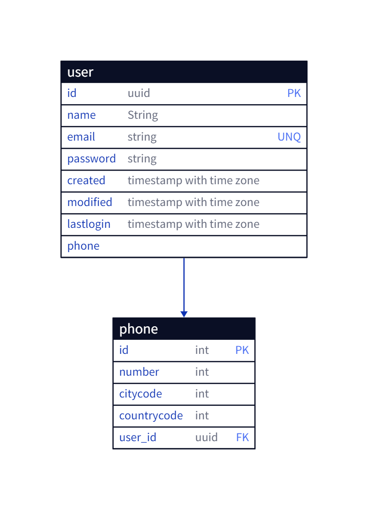

## nisum-test

### Version API

| Version | Mayor | Menor |
|:-------:|:----:|:----:|
| 1 | 0 | 0 | |

### Categories
Api RESTfull with Spring Boot 3.0.12

JavaSE-17 

SDK-17

OpenAPI v3

### Tools
Java:
java version "17.0.9" 2023-10-17 LTS
Java(TM) SE Runtime Environment (build 17.0.9+11-LTS-201)
Java HotSpot(TM) 64-Bit Server VM (build 17.0.9+11-LTS-201, mixed mode, sharing)

Maven:
Apache Maven 3.9.5 (57804ffe001d7215b5e7bcb531cf83df38f93546)

### IDE
IntelliJ IDEA 2023.2.3 (Community Edition)
Build #IC-232.10072.27, built on October 11, 2023
Runtime version: 17.0.8.1+7-b1000.32 amd64

### Libraries
**Spring Web WEB** - Build web, including RESTful, applications using Spring MVC.
Uses Apache Tomcat as the default embedded container.

H2 Database SQL

Provides a fast in-memory database that supports JDBC API
and R2DBC access, with a small (2mb) footprint. Supports embedded and server modes as well as a browser based console application.

Spring Data JPA SQL
Persist data in SQL stores with Java Persistence API using Spring Data and Hibernate.

### Database
does not require a script

* [Browser IDE](http://localhost:8080/h2-console)

click in connect button

### API Documentation
* [Browser Docs](http://localhost:8080/doc/swagger-ui/index.html)

### Developed
Jorge F. Sanders Álvarez
lordsanders@gmail.com

